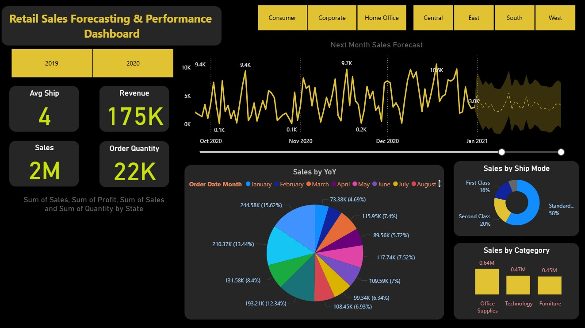

# 📊 Retail Sales Forecasting Dashboard

## 📌 Overview

**Retail Sales Forecasting** is a data analytics and visualization project designed to analyze retail sales performance and generate future sales predictions. The project focuses on transforming raw sales data into meaningful insights using interactive dashboards and forecasting models.

By combining **data analysis, business intelligence dashboards, and time series forecasting**, this project helps businesses understand their sales trends and make informed strategic decisions.

The goal of this project is to help retail businesses improve **operational efficiency, inventory planning, and identify growth opportunities.**

---

## 📑 Table of Contents

* [Project Objective](#project-objective)
* [Dashboard Preview](#dashboard-preview)
* [Key Features](#key-features)
* [Data Analysis](#data-analysis)
* [Sales Forecasting](#sales-forecasting)
* [Data Source](#data-source)
* [How to Use](#how-to-use)
* [Contributing](#contributing)
---

# 🎯 Project Objective

The main objective of the **Retail Sales Forecasting project** is to use analytical techniques to extract insights from historical sales data and predict future performance.

This dashboard-driven solution helps stakeholders:

* Monitor important **sales KPIs**
* Analyze **sales trends over time**
* Understand **customer and product performance**
* Generate **short-term sales forecasts**
* Support **data-driven business decisions**

By providing clear insights and predictive analysis, the project aims to help retail businesses enhance **profitability and operational planning.**

---

# 🖥️ Dashboard Preview



---

# 🚀 Key Features

## 📈 KPI Tracking

The dashboard highlights important **Key Performance Indicators (KPIs)** such as:

* Total Sales
* Profit
* Order Quantity
* Regional Performance

These KPIs help monitor overall business health and performance.

---

## 🎛️ Interactive Dashboard

Users can interact with visual elements such as:

* Filters
* Charts
* Slicers

This allows users to explore the data from different perspectives such as **region, category, and time period.**

---

## 🧩 Clean and Intuitive Design

The dashboard is designed with **simplicity and clarity**, making it easy for **non-technical stakeholders** to understand business performance quickly.

---

## 📊 Data-Driven Decision Support

The insights generated through the dashboard help management to:

* Identify growth opportunities
* Improve marketing strategies
* Optimize operational performance

---

## 💡 Actionable Recommendations

Based on analysis and forecasting results, recommendations are provided to help improve **sales performance and maximize revenue.**

---

# 🔍 Data Analysis

The project performs **Exploratory Data Analysis (EDA)** to identify patterns and trends in retail sales data.

Key analytical insights include:

* Sales performance across different regions
* Product category contribution to revenue
* Monthly and yearly sales trends
* Profitability analysis
* Impact of different sales strategies

The results are presented through **interactive charts and visual dashboards** to make the insights easy to understand.

---

# 🔮 Sales Forecasting

The **Retail Sales Forecasting system** uses **time series analysis** on historical sales data to predict future sales trends.

## Forecast Details

* **Forecast Horizon:** Next 30 Days
* **Prediction Confidence:** 95% Confidence Interval
* Uses historical sales patterns to estimate future performance

These forecasts help businesses plan:

* Inventory management
* Staff allocation
* Supply chain operations
* Marketing campaigns

---

# 📂 Data Source

The dataset used in this project is based on the **publicly available Superstore retail sales dataset.**

Some preprocessing and data transformation steps were performed to ensure **data consistency and accuracy** before analysis.

---

# ⚙️ How to Use

Follow these steps to run the project locally.

### 1️⃣ Clone the Repository

```bash
git clone https://github.com/anshi3101/data-analyst-sales-dashboard
```

### 2️⃣ Open the Dashboard

Open the file:

```
retail_sales_forecasting.pbix
```

in **Microsoft Power BI Desktop.**

### 3️⃣ Refresh the Data

Click **Refresh** in Power BI to load the dataset and update dashboard visuals.

### 4️⃣ Explore Insights

Use the **interactive charts, filters, and slicers** to explore sales trends and forecasting results.